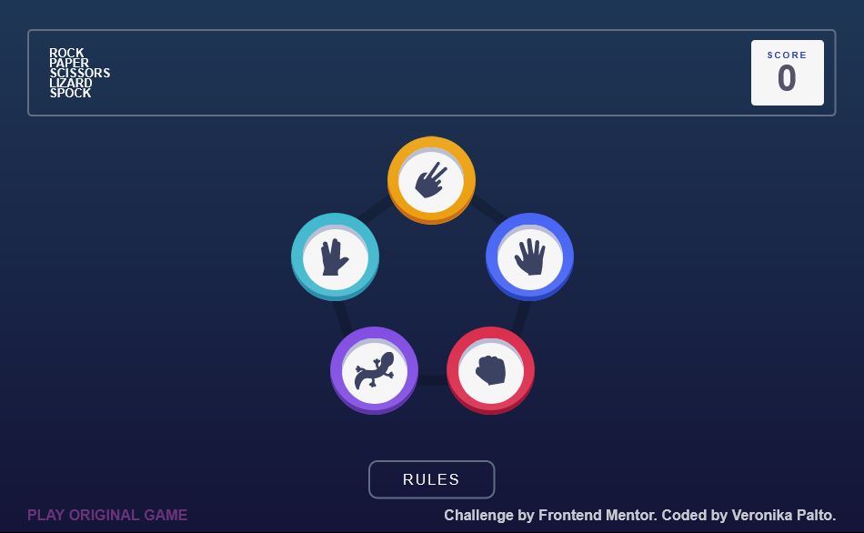

# Frontend Mentor - Rock, Paper, Scissors solution

This is a solution to the [Rock, Paper, Scissors challenge on Frontend Mentor](https://www.frontendmentor.io/challenges/rock-paper-scissors-game-pTgwgvgH). Frontend Mentor challenges help you improve your coding skills by building realistic projects.

## Overview

### The challenge

Users should be able to:

- View the optimal layout for the game depending on their device's screen size
- Play Rock, Paper, Scissors against the computer _(on other page)_
- Maintain the state of the score after refreshing the browser
- Play Rock, Paper, Scissors, Lizard, Spock against the computer

### Screenshot

### Links

- Solution URL: [Frontend Mentor](https://www.frontendmentor.io/solutions/sass-css-animations-js-mobilefirst-i3-sfffmx)
- Live Site URL: [Netlify](https://festive-ritchie-ff3d6c.netlify.app/)

## Built with

- Semantic HTML5 markup
- CSS custom properties
- SASS
- CSS animations
- Flexbox
- Mobile-first workflow
- JavaScript ES6
- Gulp and Webpack

## Author

- Frontend Mentor - [@yourusername](https://www.frontendmentor.io/profile/yourusername)
